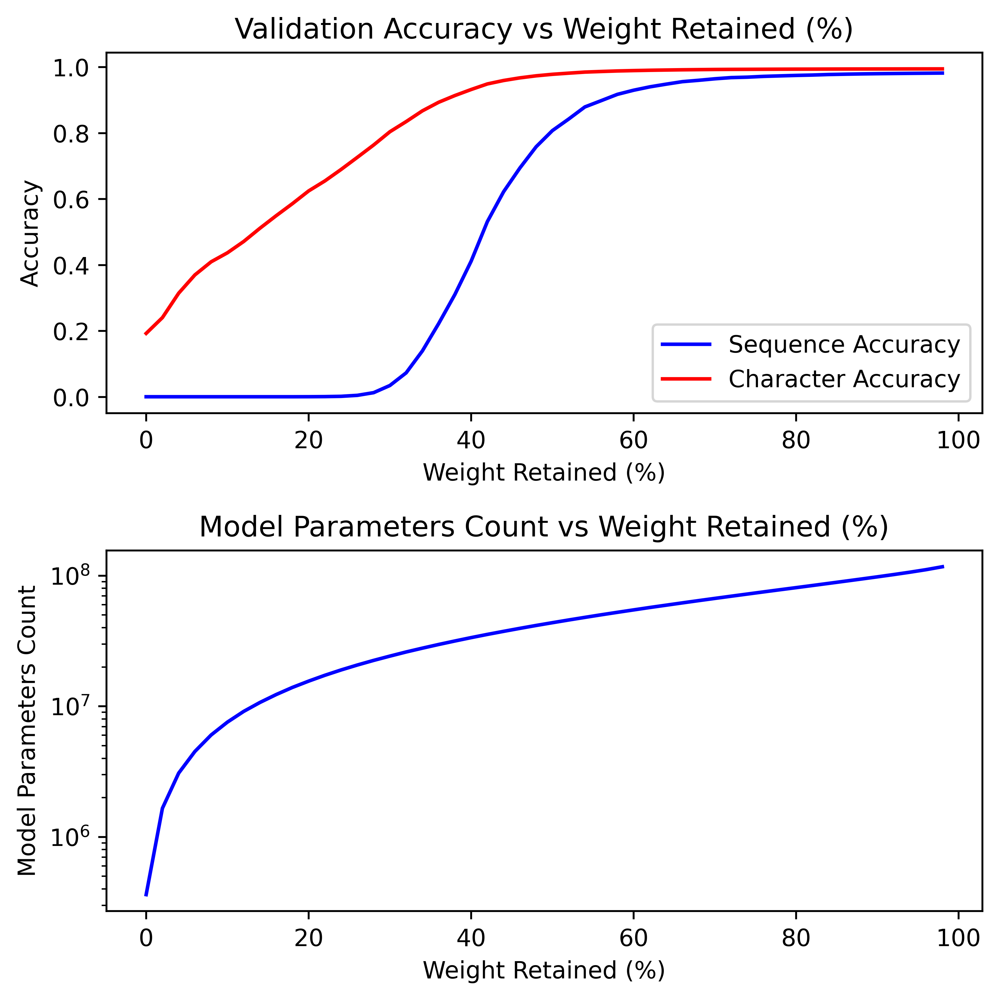
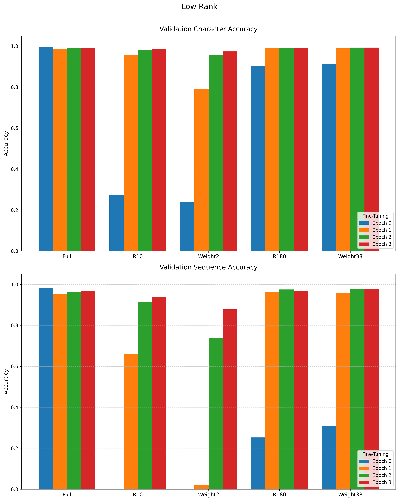
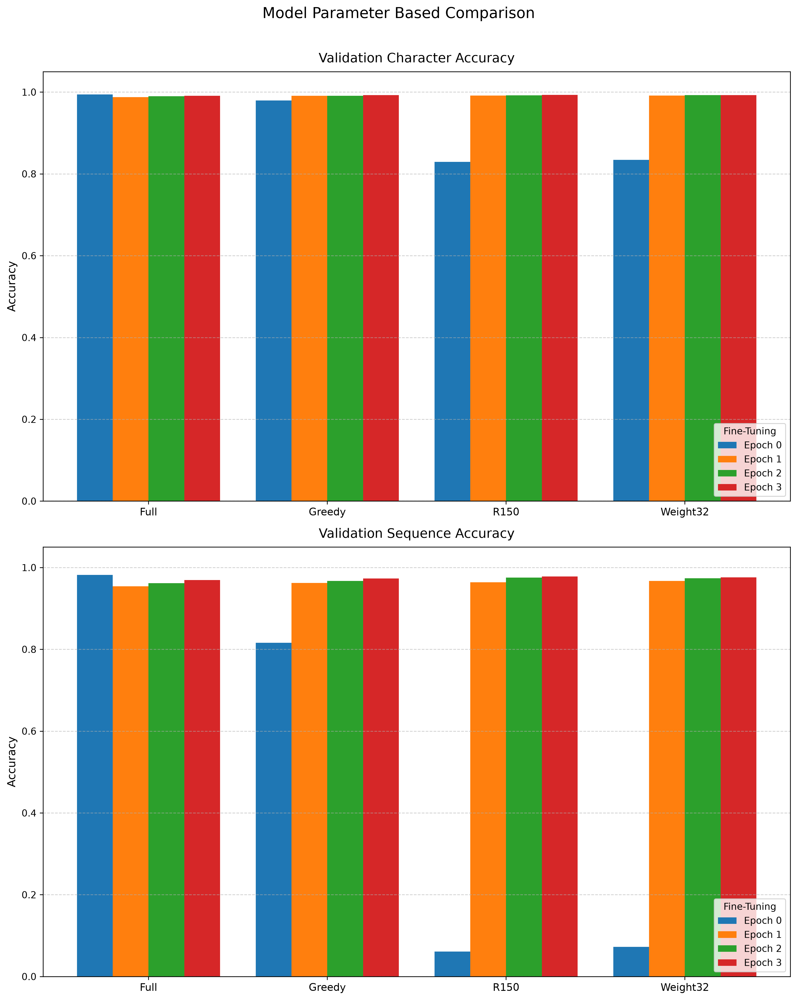

# Low Rank Approximation of Transformers for Decryption of Simple Ciphers

We train a BERT style transformer model trained to decrypt simple cesar ciphers. Once trained, the weight matrices are compressed using low-rank approximations via SVD. This enables us to benchmark how this method of model simplification impacts total parameter count, computational efficiency, and decryption accuracy.

## To Run

### Locally

1. [Install PyTorch using the relevant command](https://pytorch.org/get-started/locally/)
2. Install other requirements: `pip install -r requirements.txt`

### RunPod + Cloudflare R2

1. Set the `.env` file in the root of the repo as below

```env
RUNPOD_API_KEY=

R2_ACCESS_KEY_ID=
R2_SECRET_ACCESS_KEY=
R2_ENDPOINT=
R2_BUCKET=
```

2. Install requirements: `pip install -r requirements.txt`
3. Run `python deploy/runpod-deploy.py`

### Production Benchmarking

To evaluate throughput and performance increases, saved model checkpoints (such as `model/full_rank.pth` and compressed variants like `model/Greedy98_50_15.pth`) can be deployed via FastAPI inside Docker containers on AWS.

## Results

You can find logarithmic scale scree plots generated using matplotlib for each matrix [here](img/scree.png) and our full results tables [here](output.txt).

We compare three primary categories of compression strategies against our uncompressed baseline (~85.1M parameters). We evaluate both extreme compression (to test the limits of recovery) and moderate parameter-based compression. 

| Strategy Type | Configurations Tested | Description |
| :--- | :--- | :--- |
| **Uniform Rank** | `R10`, `R150` | All target matrices compressed to a strict, uniform rank across all layers. |
| **Uniform Weight** | `Weight2`, `Weight32` | Matrices compressed to retain a specific top percentage of their singular values by weight. |
| **Greedy** | `Greedy` | Iteratively reduces the rank of matrices individually, accepting changes that cause the smallest spike in loss until a target training character accuracy (e.g., 98.5%) is reached. |

*Note: We never compress the final output layer.*

### Extreme Compression vs. Parameter Recovery




When pushing the SVD compression to extremes (`R10` and `Weight2`), the model parameter count is slashed from 85,129,760 to under 2,000,000. 

* **Observation:** This aggressive truncation effectively destroys the model's zero-shot decryption capabilities immediately after compression (0% validation sequence accuracy at `E0`). 
* **Recovery:** However, just three epochs of fine-tuning (`E3`) allow the `R10` model to recover to 93.7% validation sequence accuracy, demonstrating the high plasticity of the low-rank matrices.

### Moderate Compression & The Greedy Advantage


When targeting a more moderate parameter footprint (~25M to ~35M parameters), the difference between compression algorithms becomes clear in the initial, pre-fine-tuning phase (`E0`).

* **Uniform Rank (`R150`) vs Uniform Weight (`Weight32`):** Both drop to roughly 6-7% sequence accuracy immediately after compression. While they both recover remarkably well by `E3` (reaching ~97.7% and ~97.5% validation sequence accuracy, respectively), they require the fine-tuning phase to re-align the truncated weights.
* **The Greedy Strategy:** The greedy algorithm retains slightly more parameters (~35.7M) but demonstrates vastly superior intelligence in *where* it makes cuts. The heatmap visualizes this final retained rank distribution across the network layers after iterative pruning.
* **Observation:** By selectively targeting early feed-forward networks or attention heads that contribute less to the final objective, the greedy strategy preserves the highly sensitive bottleneck layers. At `E0` (zero epochs of fine-tuning), it maintains an 81.5% validation sequence accuracy, and after three epochs, it reaches a highly efficient 97.3%.

### Fine-Tuning is Critical




**Observation:** Across all configurations, introducing a subsequent fine-tuning phase was essential to recover the accuracy lost during the initial SVD compression. By allowing the compressed models to continue training for just 1 to 3 epochs, the low-rank matrices adapt and compensate for the truncated singular values. This approach bridges the performance gap, yielding highly efficient models with a minimal parameter footprint and preserved decryption capabilities.

## Model

Our model is a pre-LN variant of a BERT-style encoder using ReLU activations and additive learned positional embeddings. The architecture relies on streamlined, modular functions for the scaled dot-product attention and transformer blocks.

| Parameter  | Value |
| ---------- | ----- |
| vocab_size | 32    |
| seq_len    | 32    |
| d_model    | 768   |
| n_heads    | 12    |
| d_ff       | 3072  |
| n_layers   | 12    |


[](write-up/model-diagram.pdf)

## Data

- Training data is from [Hugging face, agentlans/high-quality-english-sentences](https://huggingface.co/datasets/agentlans/high-quality-english-sentences)
- We convert all characters to lower case and remove all characters that are not alphabetic characters or a space
- We extract 32 characters from the start of each sentence (removing those not long enough)
- We encrypt each sentence using one random key shift
- We then train and test on approximately 32,000 (Encrypted text, Decrypted text) pairs

## Citations

- Alammar, Jay. ‘The Illustrated Transformer’. Accessed 1 September 2026. https://jalammar.github.io/illustrated-transformer/.
- Andrej Karpathy. Let’s Build GPT: From Scratch, in Code, Spelled Out. 2023. 1:56:19. https://www.youtube.com/watch?v=kCc8FmEb1nY.
- Ba, Jimmy Lei, Jamie Ryan Kiros, and Geoffrey E. Hinton. ‘Layer Normalization’. arXiv:1607.06450. Preprint, arXiv, 21 July 2016. https://doi.org/10.48550/arXiv.1607.06450.
- Devlin, Jacob, Ming-Wei Chang, Kenton Lee, and Kristina Toutanova. ‘BERT: Pre-Training of Deep Bidirectional Transformers for Language Understanding’. arXiv:1810.04805. Preprint, arXiv, 24 May 2019. https://doi.org/10.48550/arXiv.1810.04805.
- ‘The Annotated Transformer’. Accessed 1 September 2026. https://nlp.seas.harvard.edu/annotated-transformer/.
- Xiong, Ruibin, Yunchang Yang, Di He, et al. ‘On Layer Normalization in the Transformer Architecture’. arXiv:2002.04745. Preprint, arXiv, 29 June 2020. https://doi.org/10.48550/arXiv.2002.04745.
- YouTube. ‘3blue1brown - Deep Learning’. Accessed 30 August 2026. http://www.youtube.com/playlist?list=PLOH0RpNCcyWRxD8bYrbZbVZrto0U8axHR.