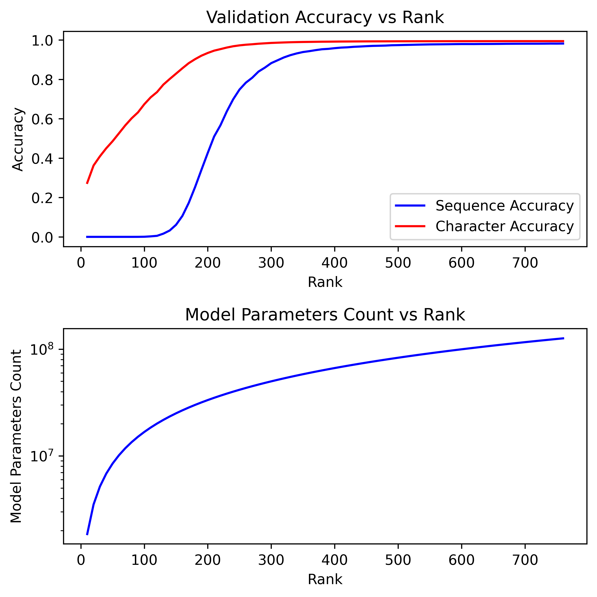
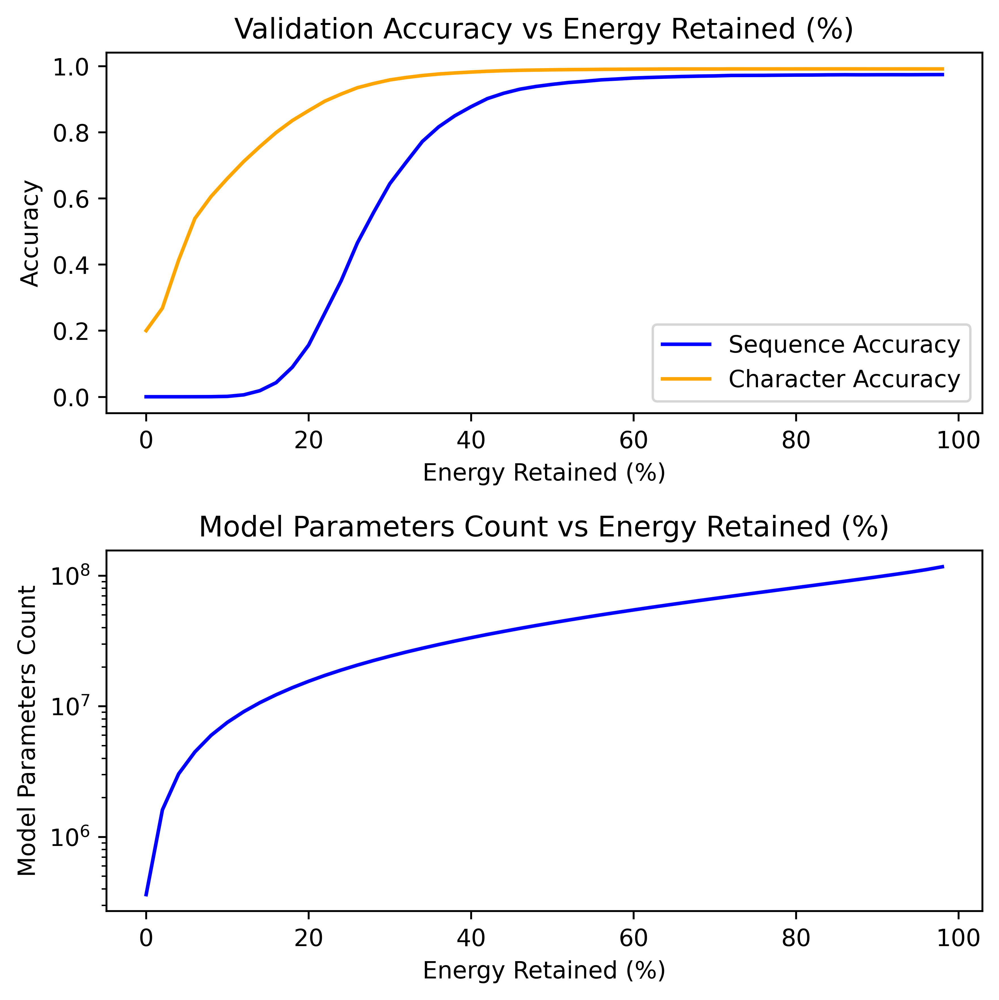
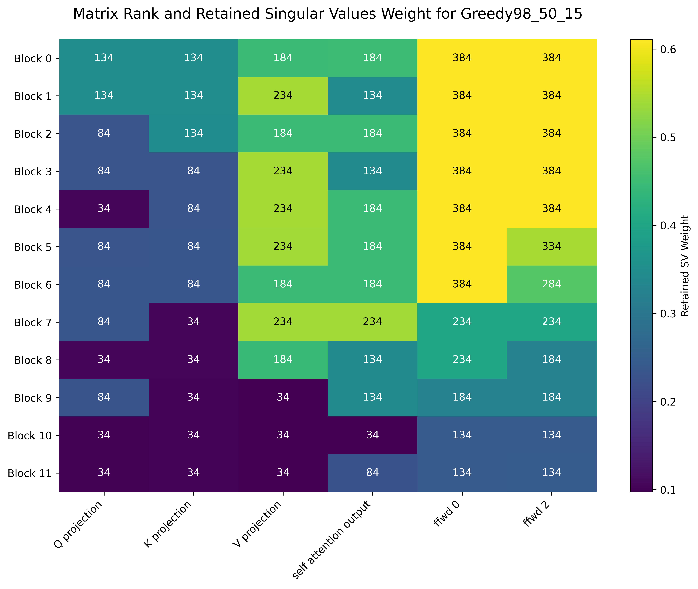
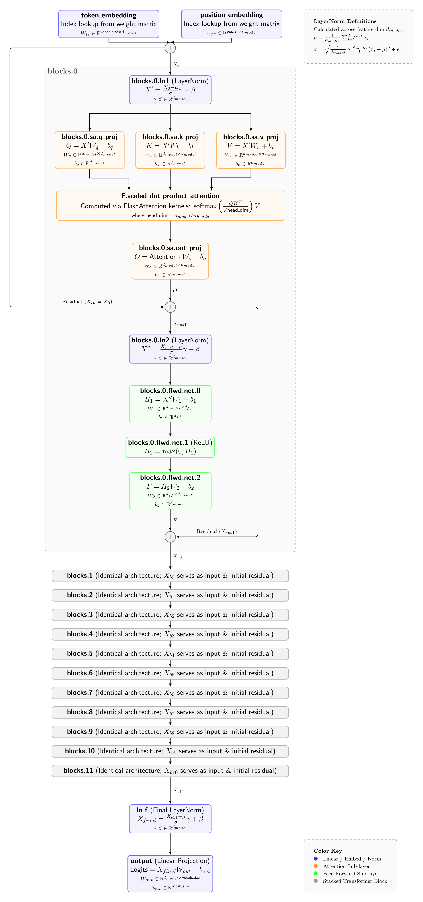

# Low Rank Approximation of Transformers for Decryption of Simple Ciphers

We train a BERT style transformer model trained to decrypt simple cesar ciphers. Once trained, the weight matrices are compressed using low-rank approximations via SVD. This enables us to benchmark how this method of model simplification impacts total parameter count, computational efficiency, and decryption accuracy.

## To Run

### Locally

1. [Install PyTorch using the relevant command](https://pytorch.org/get-started/locally/)
2. Install other requirements: `pip install -r requirements.txt`

### RunPod + Cloudflare R2

1. Set the `.env` file in the root of the repo as below

```
RUNPOD_API_KEY=

R2_ACCESS_KEY_ID=
R2_SECRET_ACCESS_KEY=
R2_ENDPOINT=
R2_BUCKET=
```

2. Install requirements: `pip install -r requirements.txt`
3. Run `python deploy/runpod-deploy.py`


## Results

You can find scree plots for each matrix [here](img/scree_plots/scree.png) and our full results tables [here](output.txt)

We compare three different compression strategies:

| Strategy Name | Description                                                                                  |
| ------------- | -------------------------------------------------------------------------------------------- |
| R100          | All matrices compressed to rank 100, except for the final output layer                       |
| Energy95      | All matrices are compressed so that they have the top 95% of their singular values by weight |
| Greedy95_10_5 | Iterated until the training character accuracy is just above 95%; at each iteration, reduces the rank of each matrix by 10 individually and accepts the 5 changes that make the smallest change in the loss. |

Note we never compress the final output layer.

### Uniform Rank



### Uniform Singular Value Weight



### Greedy Algorithm




## Model

Our model is a pre-LN variant of a BERT-style encoder using ReLU activations and additive learned positional embeddings.

| Parameter  | Value |
| ---------- | ----- |
| vocab_size | 32    |
| seq_len    | 32    |
| d_model    | 768   |
| n_heads    | 12    |
| d_ff       | 3072  |
| n_layers   | 12    |

[](write-up/model-diagram.pdf)

## Data

- Training data is from [Hugging face, agentlans/high-quality-english-sentences](https://huggingface.co/datasets/agentlans/high-quality-english-sentences)
- We convert all characters to lower case and remove all characters that are not alphabetic characters or a space
- We extract 32 characters from the start of each sentence (removing those not long enough)
- We encrypt each sentence using one random key shift
- We then train and test on approximately 32,000 $(\text{Encrypted text}, \text{Decrypted text})$ pairs

## Citations

- Alammar, Jay. ‘The Illustrated Transformer’. Accessed 1 September 2026. https://jalammar.github.io/illustrated-transformer/.
- Andrej Karpathy. Let’s Build GPT: From Scratch, in Code, Spelled Out. 2023. 1:56:19. https://www.youtube.com/watch?v=kCc8FmEb1nY.
- Ba, Jimmy Lei, Jamie Ryan Kiros, and Geoffrey E. Hinton. ‘Layer Normalization’. arXiv:1607.06450. Preprint, arXiv, 21 July 2016. https://doi.org/10.48550/arXiv.1607.06450.
- Devlin, Jacob, Ming-Wei Chang, Kenton Lee, and Kristina Toutanova. ‘BERT: Pre-Training of Deep Bidirectional Transformers for Language Understanding’. arXiv:1810.04805. Preprint, arXiv, 24 May 2019. https://doi.org/10.48550/arXiv.1810.04805.
- ‘The Annotated Transformer’. Accessed 1 September 2026. https://nlp.seas.harvard.edu/annotated-transformer/.
- Xiong, Ruibin, Yunchang Yang, Di He, et al. ‘On Layer Normalization in the Transformer Architecture’. arXiv:2002.04745. Preprint, arXiv, 29 June 2020. https://doi.org/10.48550/arXiv.2002.04745.
- YouTube. ‘3blue1brown - Deep Learning’. Accessed 30 August 2026. http://www.youtube.com/playlist?list=PLOH0RpNCcyWRxD8bYrbZbVZrto0U8axHR.
